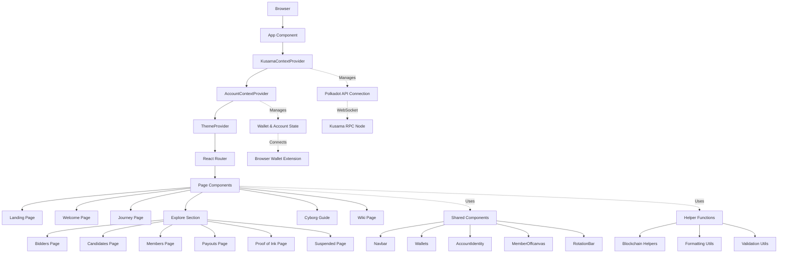
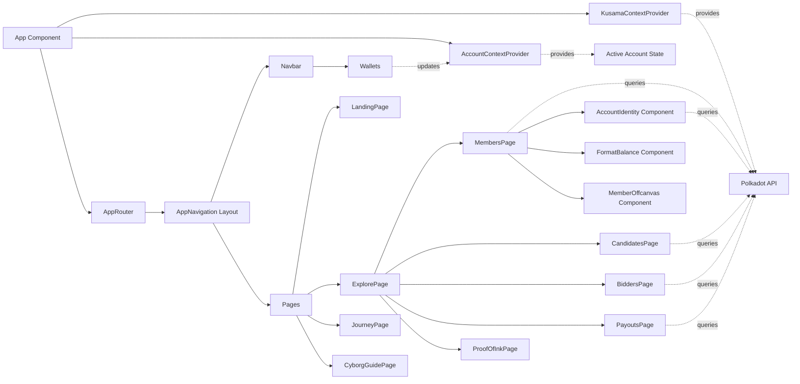

# KappaSigmaMu - Kusama Society Interface Architecture Analysis

## Introduction

This document provides a comprehensive analysis of the KappaSigmaMu architecture as it currently exists. It serves as a reference for understanding the system structure, technology choices, and implementation patterns.

**Document Purpose:**
- Understand existing codebase architecture
- Identify current patterns and conventions
- Document technology stack and infrastructure
- Create foundation for future planning

### Analysis Scope

- **Project Root:** `/home/admin/coding-sessions/kusama-society/kappasigmamu.github.io`
- **Analysis Date:** 2026-03-27
- **Documentation Reviewed:** README.md, package.json, configuration files, source code
- **Scope:** Complete frontend architecture analysis including React application structure, blockchain integration, component hierarchy, state management, styling, testing, and deployment configuration

### Change Log

| Change | Date | Version | Description | Author |
|--------|------|---------|-------------|--------|
| Initial architecture analysis | 2026-03-27 | 1.0 | Complete brownfield architecture documentation | Architect |

---

## Project Overview

### Project Purpose

**Primary Purpose:** A dedicated frontend interface for the Kusama Society, enabling users to interact with the Kusama blockchain Society pallet through a web application.

**Target Audience:** Kusama Society participants including humans, bidders, candidates, and cyborgs (members) who need to manage their participation, view member information, track payouts, and interact with society governance.

**Current State:** Production application deployed to GitHub Pages at https://KappaSigmaMu.github.io/, actively maintained with version 2.0.1

### Key Features

- Wallet connection and management (Polkadot.js extension, Talisman wallet support)
- Account identity and level tracking (human, bidder, candidate, cyborg)
- Society member exploration and profiles with Proof-of-Ink images
- Bidder and candidate tracking
- Payout history and management
- Society rotation and governance visualization
- Journey/onboarding experience for new participants
- Educational guide (Cyborg Guide)
- Wiki and documentation access
- Real-time blockchain data integration via Polkadot API
- Responsive design for desktop and mobile

---

## Technology Stack

### Runtime Platform

- **Language:** TypeScript (~5.3.3)
- **Runtime:** Browser (React 18.2.0)
- **Package Manager:** Yarn (v4.5.1)
- **Node Version:** v18.15.0 (specified in .nvmrc)

### Frameworks & Libraries

| Category | Technology | Version | Purpose |
|----------|-----------|---------|---------|
| **UI Framework** | React | 18.2.0 | Component-based UI rendering |
| **Routing** | React Router DOM | 6.22.0 | Client-side routing and navigation |
| **Styling - Framework** | Bootstrap | 5.3.3 | Base CSS framework and grid system |
| **Styling - Components** | React Bootstrap | 2.10.1 | React Bootstrap components |
| **Styling - CSS-in-JS** | Styled Components | 6.1.8 | Component-scoped styling |
| **Styling - Preprocessor** | SASS | ~1.64.2 | SCSS preprocessing |
| **Blockchain API** | @polkadot/api | 11.3.1 | Polkadot/Kusama blockchain interaction |
| **Wallet Integration** | @talismn/connect-wallets | 1.2.5 | Multi-wallet connection support |
| **Polkadot Extension** | @polkadot/extension-dapp | 0.47.5 | Browser extension integration |
| **Utilities** | @polkadot/util | 12.6.2 | Polkadot utilities and helpers |
| **Crypto** | @polkadot/util-crypto | 12.6.2 | Cryptographic operations |
| **Markdown** | marked | 12.0.0 | Markdown parsing and rendering |
| **Icons** | react-icons | 5.0.1 | Icon library |
| **Notifications** | react-hot-toast | 2.4.1 | Toast notification system |
| **Progress UI** | react-circular-progressbar | 2.1.0 | Circular progress indicators |

### Development Tools

- **Build Tool:** Webpack (5.94.0) - Custom configuration for module bundling
- **Compiler:** Babel (7.23.9) - JavaScript/TypeScript transpilation
- **Linter:** ESLint (8.56.0) with TypeScript plugin - Code quality enforcement
- **Formatter:** Prettier (.prettierrc configuration) - Code formatting
- **Unit Testing:** Jest (29.7.0) with jsdom environment - Component and unit testing
- **E2E Testing:** Cypress (13.6.4) - End-to-end browser testing
- **Type Checking:** TypeScript compiler (tsc) with strict configuration
- **Hot Reload:** React Refresh Webpack Plugin (0.5.11) - Development hot module replacement
- **CSS Extraction:** Mini CSS Extract Plugin (2.8.0) - Production CSS bundling

### Infrastructure & DevOps

- **Hosting:** GitHub Pages with Netlify support
- **Deployment:** gh-pages npm package for automated GitHub Pages deployment
- **Environment Management:** dotenv (16.4.2) with .env files per environment
- **Container Support:** Docker and docker-compose for local development
- **CI/CD:** GitHub Actions workflows (`.github/` directory)
- **Development Server:** webpack-dev-server (4.15.1) with hot reload
- **Local Blockchain:** Chopsticks (@acala-network/chopsticks@1.0.6) for Kusama fork testing

---

## Architecture Overview

### Architecture Style

**Style:** Single Page Application (SPA) with Component-Based Architecture

**Pattern:** Context Provider Pattern for state management, Container/Presentational component separation

**Description:** The application follows a modern React SPA architecture with centralized blockchain and account state managed through React Context providers. The application is organized around feature-based routing with nested page components, shared UI components, and blockchain integration layers. The architecture emphasizes:

- **Separation of Concerns:** Business logic (contexts), presentation (components), and utilities (helpers) are clearly separated
- **Provider Hierarchy:** KusamaContext wraps AccountContext, establishing a clear data flow from blockchain connection → account management → UI
- **Page-based Routing:** React Router v6 with nested routes for feature sections
- **Component Reusability:** Shared components in `/components` and feature-specific components colocated with pages
- **Type Safety:** TypeScript throughout with Polkadot type definitions

### High-Level Architecture Diagram



---

## Source Code Organization

### Directory Structure

```plaintext
kappasigmamu.github.io/
├── public/                      # Static assets served directly
├── src/                         # Application source code
│   ├── account/                 # Account context and management
│   │   └── AccountContext.tsx   # Account state provider
│   ├── assets/                  # Images, fonts, media files
│   ├── components/              # Shared reusable components
│   │   ├── base/                # Base/primitive components
│   │   ├── rotation-bar/        # Society rotation visualization
│   │   ├── Navbar.tsx           # Main navigation component
│   │   ├── Wallets.tsx          # Wallet connection UI
│   │   ├── AccountIdentity.tsx  # Account display component
│   │   └── ...                  # Other shared components
│   ├── helpers/                 # Utility functions and helpers
│   │   ├── test-utils/          # Testing utilities
│   │   ├── extrinsics.ts        # Blockchain transaction helpers
│   │   ├── wallets.ts           # Wallet configuration
│   │   └── validAccount.tsx     # Account validation
│   ├── hooks/                   # Custom React hooks
│   ├── kusama/                  # Kusama blockchain integration
│   │   └── KusamaContext.tsx    # Kusama API provider
│   ├── pages/                   # Page components (route destinations)
│   │   ├── explore/             # Explore section pages
│   │   │   ├── BiddersPage/     # Bidders listing
│   │   │   ├── CandidatesPage/  # Candidates listing
│   │   │   ├── MembersPage/     # Members listing
│   │   │   ├── PayoutsPage/     # Payout history
│   │   │   ├── ProofOfInkPage/  # Proof of Ink gallery
│   │   │   └── SuspendedPage/   # Suspended members
│   │   ├── App.tsx              # Root app component with routing
│   │   ├── LandingPage.tsx      # Home/landing page
│   │   └── ...                  # Other top-level pages
│   ├── static/                  # Static content and data files
│   ├── styles/                  # Global styles and theme
│   │   ├── bootstrap.scss       # Bootstrap customization
│   │   ├── globalStyle.ts       # Global styled-components
│   │   └── Theme.ts             # Theme configuration
│   ├── types/                   # TypeScript type definitions
│   ├── index.tsx                # Application entry point
│   └── react-app-env.d.ts       # React app type definitions
├── config/                      # Webpack and build configuration
│   ├── webpack.config.js        # Webpack bundler config
│   ├── webpackDevServer.config.js # Dev server config
│   ├── env.js                   # Environment variable handling
│   ├── paths.js                 # Build path configuration
│   └── kusama.yml.sample        # Chopsticks config sample
├── scripts/                     # Build and utility scripts
│   ├── build.js                 # Production build script
│   ├── start.js                 # Development server script
│   ├── test.js                  # Test runner script
│   └── poi/                     # Proof of Ink image management scripts
├── cypress/                     # E2E test specs and fixtures
│   ├── e2e/                     # Test specifications
│   ├── fixtures/                # Test data
│   └── support/                 # Cypress support files
├── .github/                     # GitHub Actions CI/CD workflows
├── docs/                        # Documentation files
│   └── internal/                # Internal architecture docs
├── .env.development.sample      # Development environment template
├── .env.production              # Production environment config
├── .env.test                    # Test environment config
├── package.json                 # Dependencies and scripts
├── tsconfig.json                # TypeScript configuration
├── jest.config.js               # Jest testing configuration
├── cypress.config.ts            # Cypress E2E configuration
├── .eslintrc.js                 # ESLint rules
├── .prettierrc                  # Prettier formatting rules
├── babel.config.json            # Babel transpiler config
├── Dockerfile                   # Docker container definition
├── docker-compose.yml           # Docker Compose orchestration
└── README.md                    # Project documentation
```

### Organization Patterns

**File Naming:**
- PascalCase for React components (e.g., `AccountContext.tsx`, `MembersPage.tsx`)
- camelCase for utility files and helpers (e.g., `extrinsics.ts`, `wallets.ts`)
- kebab-case for configuration files (e.g., `webpack.config.js`)

**Module Organization:**
- Feature-based organization for pages (each page in its own directory with components subfolder)
- Type-based organization at the top level (components/, helpers/, pages/, etc.)
- Colocation principle: Feature-specific components live with their parent pages

**Code Grouping:**
- Contexts grouped by domain (account, kusama)
- Pages grouped by feature area with nested routing structure
- Shared components centralized in `/components`
- Helpers organized by functionality (blockchain, formatting, validation)
- Import ordering enforced by ESLint: external dependencies first, then internal modules, alphabetically sorted

---

## Data Architecture

### Database Overview

- **Database Type:** N/A - No traditional database
- **Specific Technology:** Blockchain as Data Layer (Kusama blockchain via Polkadot API)
- **Version:** Kusama runtime (via RPC connection)
- **Deployment Model:** Decentralized blockchain network (public RPC endpoints)
- **ORM/Query Tool:** Polkadot API with TypeScript bindings (@polkadot/api)
- **Schema Management:** Defined by Kusama runtime pallets (particularly Society pallet)
- **Migration Tool:** N/A - Schema defined by blockchain runtime upgrades

**Data Storage Strategy:**
- **Blockchain:** Authoritative data source for all society-related information (members, bids, candidates, payouts)
- **Browser LocalStorage:** Active account preference persistence
- **IPFS:** Proof-of-Ink member images (Pinata for pinning)
- **In-Memory:** React Context state for current session data

### Read Operations Architecture

**Primary Read Patterns:**
- Query blockchain state via Polkadot API storage queries (e.g., `api.query.society.members()`)
- Subscribe to blockchain state changes for real-time updates
- Fetch static content from IPFS for member images

**Query Complexity:**
- **Simple Queries:** Direct storage lookups (e.g., get member list, get specific account balance)
- **Complex Queries:** Derived data combining multiple storage calls (e.g., member details with identity, payout history with aggregations)

**Indexing Strategy:**
- No application-level indexing (blockchain provides indexed access via storage keys)
- IPFS Content Identifier (CID) addressing for images

**Read Optimization:**
- **Caching:** React Context caching for blockchain connection state
- **Query Optimization:** Batch queries using `api.query.society` multi-calls
- **Read Scaling:** Multiple public RPC endpoints for load distribution

**Common Read Operations:**
- `society.members.keys()` - Retrieve all society members
- `society.bids()` - Get current bidders
- `society.candidates.keys()` - Get current candidates
- `identity.identityOf()` - Fetch account identity information
- `system.account()` - Get account balance and nonce

### Write Operations Architecture

**Primary Write Patterns:**
- Blockchain transactions (extrinsics) signed by user wallet
- LocalStorage writes for user preferences

**Write Operations:**
- **Inserts:** Submit extrinsics via `api.tx.society.*` methods (e.g., bid, vote, vouch)
- **Updates:** State changes occur via blockchain transaction execution
- **Deletes:** Not applicable (blockchain is append-only)
- **Bulk Operations:** Batch extrinsics via `api.tx.utility.batch()`

**Transaction Handling:**
- **Transaction Support:** Full blockchain transaction support with signature verification
- **Isolation Level:** Blockchain consensus-level isolation
- **Consistency Guarantees:** Eventual consistency via blockchain finality (typically 2-3 blocks)

**Write Optimization:**
- **Batching:** Utility pallet batch calls for multiple operations
- **Async Writes:** All blockchain writes are asynchronous with callback/promise handling
- **Write Scaling:** Handled by blockchain network validators

**Data Validation:**
- **Application-level:** React form validation, wallet signature verification
- **Database-level:** Blockchain runtime validation (pallet logic, weight limits, permissions)

### Data Access Patterns

**Data Access Pattern:** Custom abstraction via React Context providers with direct Polkadot API integration

**Connection Management:**
- **Connection Pooling:** Single WebSocket connection managed by KusamaContext
- **Pool Size:** One persistent connection with automatic reconnection handling

**Query Construction:**
- **ORM Usage:** 0% (no traditional ORM)
- **Query Builder:** 100% Polkadot API storage queries
- **Raw SQL:** N/A

**Abstraction Layers:**
- **KusamaContext:** Manages API connection lifecycle, provides api instance to application
- **AccountContext:** Abstracts wallet connection and account level determination
- **Helper functions:** Encapsulate common blockchain operations (e.g., `extrinsics.ts`)
- **Custom hooks:** Potential for blockchain data fetching hooks (in `/hooks` directory)

### Data Models

#### Member

**Purpose:** Represents a Kusama Society member (cyborg)

**Storage:** Blockchain storage map `society.members`

**Key Attributes:**
- `address` (AccountId32): Blockchain account address
- `rank` (u32): Member rank in society
- `strikes` (u32): Number of strikes against member

**Relationships:**
- Has optional `Identity` (via `identity.identityOf`)
- Has optional Proof-of-Ink image (via IPFS hash)
- Related to `Payouts` history

**Indexes:**
- Indexed by AccountId32 on blockchain

#### Candidate

**Purpose:** Represents an account currently in candidacy phase

**Storage:** Blockchain storage map `society.candidates`

**Key Attributes:**
- `address` (AccountId32): Candidate account
- `kind` (CandidateKind): Type of candidacy (Bid, Vouch, etc.)
- `value` (Balance): Bid amount or stake

**Relationships:**
- Becomes `Member` upon acceptance
- Related to `Votes` from current members

**Indexes:**
- Indexed by AccountId32 on blockchain

#### Bidder

**Purpose:** Represents an account that has placed a bid to join society

**Storage:** Blockchain storage value `society.bids`

**Key Attributes:**
- `who` (AccountId32): Bidder account
- `kind` (BidKind): Deposit or Vouch
- `value` (Balance): Bid amount

**Relationships:**
- Can become `Candidate` when selected
- May have `Voucher` (existing member)

**Indexes:**
- Array storage (ordered by bid value)

#### Account

**Purpose:** General blockchain account with identity

**Storage:** Blockchain storage map `system.account` and `identity.identityOf`

**Key Attributes:**
- `address` (AccountId32): Account identifier
- `balance` (Balance): Account balance
- `nonce` (Index): Transaction nonce
- `identity` (Registration): On-chain identity (display name, email, social handles, etc.)

**Relationships:**
- Can be Member, Candidate, Bidder, or Human
- Has wallet connection state (managed in AccountContext)

**Indexes:**
- Indexed by AccountId32 on blockchain

### Database Performance Characteristics

**Read Performance:**
- **Typical Read Latency:** 200-500ms (depends on RPC endpoint and network conditions)
- **Read Throughput:** Unlimited reads (public RPC endpoints may have rate limits)

**Write Performance:**
- **Typical Write Latency:** 12-24 seconds (2-4 Kusama block times for finalization)
- **Write Throughput:** Limited by blockchain block capacity and transaction fees

**Performance Bottlenecks:**
- RPC endpoint availability and response time
- Multiple sequential blockchain queries (waterfall problem)
- Block finalization time for write confirmation

**Monitoring:**
- Browser console logging for API connection state
- Toast notifications for transaction status
- React Context state tracking for API readiness

### Data Flow

**Read Flow:**
1. User navigates to page requiring blockchain data
2. Component renders and hooks into KusamaContext for API instance
3. Component calls `api.query.society.*` methods
4. WebSocket RPC call sent to Kusama node
5. Response processed and state updated via React setState
6. UI re-renders with blockchain data

**Write Flow:**
1. User interacts with UI (e.g., "Place Bid" button)
2. Component retrieves wallet signer from AccountContext
3. Extrinsic created via `api.tx.society.bid()`
4. Transaction signed with wallet extension
5. Signed transaction broadcast to Kusama network
6. Transaction included in block by validator
7. Block finalized (2-3 blocks later)
8. Application receives finalization event and updates UI
9. Subsequent reads reflect new blockchain state

**Caching Flow:**
- Blockchain connection state cached in KusamaContext (prevents reconnections)
- Account selection cached in localStorage (persists across sessions)
- No application-level data caching (blockchain is source of truth)

---

## Component Architecture

### Major Components

#### KusamaContextProvider

**Location:** `src/kusama/KusamaContext.tsx`

**Responsibility:** Manages Polkadot API connection to Kusama blockchain, provides API instance and connection state to entire application

**Key Files:**
- `src/kusama/KusamaContext.tsx` (95 lines)

**Dependencies:**
- `@polkadot/api` (ApiPromise, WsProvider)
- Environment variables for RPC endpoint (`REACT_APP_PROVIDER_SOCKET`)
- LoadingContainer component for connection state UI

**Used By:**
- Root App component (wraps entire application)
- AccountContextProvider (consumes api instance)
- All pages and components requiring blockchain data

**Architecture Notes:**
- Uses React useReducer for state management (API state machine)
- WebSocket connection with automatic reconnection
- State machine: initializing → connecting → connected → ready
- Exposes `api`, `apiState`, `apiError` via context

---

#### AccountContextProvider

**Location:** `src/account/AccountContext.tsx`

**Responsibility:** Manages user wallet connection, active account selection, account level determination (human/bidder/candidate/cyborg), and wallet signer integration

**Key Files:**
- `src/account/AccountContext.tsx` (118 lines)

**Dependencies:**
- KusamaContext (consumes api instance)
- `@talismn/connect-wallets` (wallet connection)
- `@polkadot/types` (type definitions)
- localStorage (account persistence)
- Wallet configuration from `helpers/wallets.ts`

**Used By:**
- All components requiring active account information
- Transaction signing flows
- Account-specific UI (Navbar, SelectedAccount)

**Architecture Notes:**
- Determines account level by querying society storage (bids, candidates, members)
- Persists active account to localStorage
- Lazy-loads wallet signer on mount
- Provides `activeAccount`, `level`, `setActiveAccount`, `setLevel` via context

---

#### App & AppRouter

**Location:** `src/pages/App.tsx`

**Responsibility:** Root application component, establishes provider hierarchy, configures routing structure

**Key Files:**
- `src/pages/App.tsx` (71 lines)

**Dependencies:**
- React Router DOM (BrowserRouter, Routes, Route)
- Styled Components (ThemeProvider)
- KusamaContextProvider
- AccountContextProvider
- All page components
- Shared components (Navbar, Toaster)

**Used By:**
- Application entry point (`src/index.tsx`)

**Architecture Notes:**
- Provider nesting order: Kusama → Account → Theme → Router
- Uses Outlet pattern for nested layouts
- Suspense boundary for lazy loading
- Custom scroll behavior (lock scroll on landing page)

---

#### Navbar

**Location:** `src/components/Navbar.tsx`

**Responsibility:** Primary navigation component with wallet connection, account display, and page links

**Key Files:**
- `src/components/Navbar.tsx` (4372 bytes)

**Dependencies:**
- React Bootstrap (Navbar, Nav, Container)
- AccountContext (account state)
- Wallets component
- SettingsDropdown component

**Used By:**
- AppNavigation layout component (shown on all pages)

**Architecture Notes:**
- Configurable props: `showAccount`, `showNavLinks`, `showBrandIcon`
- Responsive design with Bootstrap
- Wallet modal integration

---

#### Wallets

**Location:** `src/components/Wallets.tsx`

**Responsibility:** Wallet connection modal, displays available wallets, handles wallet selection and account management

**Key Files:**
- `src/components/Wallets.tsx` (7581 bytes)

**Dependencies:**
- `@talismn/connect-wallets` (wallet integration)
- AccountContext (account management)
- React Bootstrap (Modal)
- Helper: `wallets.ts` configuration

**Used By:**
- Navbar component
- Any component requiring wallet connection UI

**Architecture Notes:**
- Supports multiple wallet types (Polkadot.js, Talisman, SubWallet, etc.)
- Extension detection and installation prompts
- Account selection within wallet
- Direct integration with AccountContext

---

#### ExplorePage & Sub-pages

**Location:** `src/pages/explore/`

**Responsibility:** Hub for exploring society data - members, candidates, bidders, payouts, proof-of-ink

**Key Files:**
- `src/pages/explore/ExplorePage.tsx` (main router)
- `src/pages/explore/MembersPage/` (members listing)
- `src/pages/explore/CandidatesPage/` (candidates)
- `src/pages/explore/BiddersPage/` (bidders)
- `src/pages/explore/PayoutsPage/` (payout history)
- `src/pages/explore/ProofOfInkPage/` (image gallery)
- `src/pages/explore/SuspendedPage/` (suspended members)

**Dependencies:**
- KusamaContext for blockchain queries
- AccountContext for user state
- Shared components (AccountIdentity, FormatBalance, MemberOffcanvas)
- Helper functions (`helpers.tsx`)

**Used By:**
- App router (`/explore/*` route)

**Architecture Notes:**
- Nested routing structure
- Each sub-page queries relevant blockchain storage
- Shared helper functions for data transformation
- Responsive grid layouts with Bootstrap

---

#### RotationBar

**Location:** `src/components/rotation-bar/`

**Responsibility:** Visualizes society rotation cycle, shows current rotation phase and progress

**Key Files:**
- `src/components/rotation-bar/` (directory with helper functions)

**Dependencies:**
- KusamaContext (block data and rotation period)
- Circular progress components

**Used By:**
- Pages displaying society rotation status

**Architecture Notes:**
- Calculates rotation phase from block number
- Helper functions for rotation math
- Visual progress indicator

---

### Component Interaction Diagram



---

## External Integrations

### Kusama Blockchain RPC

- **Purpose:** Primary data source for all society information, account data, and blockchain state
- **Type:** WebSocket RPC API (Polkadot JSON-RPC)
- **Documentation:** https://polkadot.js.org/docs/api
- **Authentication:** None (public endpoints), connection-based for writes via wallet signature
- **Implementation Location:** `src/kusama/KusamaContext.tsx` (connection management), used throughout application via `useKusama()` hook

**Configuration:**
- Production: `wss://kusama-rpc.polkadot.io` (default, configurable via `.env.production`)
- Development: `ws://127.0.0.1:8000` (Chopsticks local fork) or other public endpoints
- Runtime override: Query parameter `?rpc=<websocket_url>`

---

### Browser Wallet Extensions

- **Purpose:** Transaction signing, account management, and authorization
- **Type:** Browser extension integration (@talismn/connect-wallets library)
- **Documentation:**
  - Polkadot.js: https://polkadot.js.org/docs/extension
  - Talisman: https://docs.talisman.xyz
- **Authentication:** Extension-based signature verification
- **Implementation Location:**
  - `src/helpers/wallets.ts` (wallet configuration)
  - `src/components/Wallets.tsx` (connection UI)
  - `src/account/AccountContext.tsx` (signer integration)

**Supported Wallets:**
- Polkadot.js Extension
- Talisman
- SubWallet
- Enkrypt
- Other Polkadot-compatible extensions

---

### IPFS (Pinata)

- **Purpose:** Decentralized storage for Proof-of-Ink member images
- **Type:** IPFS content addressing with Pinata pinning service
- **Documentation:**
  - IPFS: https://docs.ipfs.io
  - Pinata: https://docs.pinata.cloud
- **Authentication:** Pinata API key (for upload scripts only, not in frontend)
- **Implementation Location:**
  - `scripts/poi/` (Python upload/download/management scripts)
  - Frontend references IPFS CID for image loading

**Image Management Workflow:**
1. Images optimized and renamed locally (`scripts/poi/optimize_multiple.py`)
2. Uploaded to local IPFS node
3. Pinned to Pinata for persistence
4. CID referenced in application for image URLs

---

### GitHub Pages

- **Purpose:** Static site hosting for production deployment
- **Type:** Static file hosting
- **Documentation:** https://docs.github.com/en/pages
- **Authentication:** GitHub repository permissions
- **Implementation Location:**
  - Deployment script: `package.json` (`deploy` script uses `gh-pages`)
  - Build output: `build/` directory
  - Configuration: `homepage` field in `package.json`

---

### Netlify (Alternative Deployment)

- **Purpose:** Alternative hosting platform with preview deployments
- **Type:** Static site hosting with build integration
- **Documentation:** https://docs.netlify.com
- **Authentication:** Netlify account integration
- **Implementation Location:**
  - Configuration: `netlify.toml`
  - Build settings: Same as GitHub Pages build

---

## Infrastructure & Deployment

### Hosting & Infrastructure

**Platform:**
- **Primary:** GitHub Pages (https://KappaSigmaMu.github.io/)
- **Secondary:** Netlify (optional, configured via `netlify.toml`)
- **Local Development:** Docker Compose or direct Node.js

**Infrastructure Tools:**
- **Containerization:** Docker (Dockerfile and docker-compose.yml provided)
- **Build Tooling:** Webpack 5 with custom configuration
- **Asset Optimization:** Terser (JS minification), CSS optimization, workbox (PWA)

**Environment Variables:**
- Managed via `.env` files (`.env.development`, `.env.production`, `.env.test`)
- Key variables:
  - `REACT_APP_PROVIDER_SOCKET` - Kusama RPC WebSocket URL
  - `REACT_APP_NAME` - Application name for wallet connection
  - `REACT_APP_RPC` - Custom RPC methods (optional)
- Development sample: `.env.development.sample`

### Environments

- **Development:** Local machine with `yarn start`, connects to Chopsticks local fork or public testnet RPC
- **Test:** Cypress E2E tests with Chopsticks, Jest unit tests with mocked blockchain API
- **Production:** GitHub Pages deployment, connects to Kusama mainnet public RPC endpoints

### Deployment Process

**Process:**
1. Code changes pushed to GitHub repository
2. Local build executed: `yarn build` (Webpack production build with legacy OpenSSL provider)
3. Build artifacts generated in `build/` directory
4. Deployment via `gh-pages`: `yarn deploy` (builds and pushes to `gh-pages` branch)
5. GitHub Pages automatically serves from `gh-pages` branch

**CI/CD Tool:**
- GitHub Actions (`.github/` workflows directory)
- Cypress E2E test automation with Chopsticks and local development server
- Test command: `yarn test:e2e:ci` (starts Chopsticks → starts dev server → runs Cypress)

**Deployment Frequency:**
- On-demand manual deployments via `yarn deploy`
- Continuous integration testing on pull requests

**Build Requirements:**
- Node.js v18.15.0 (specified in `.nvmrc`)
- Legacy OpenSSL provider flag (`NODE_OPTIONS=--openssl-legacy-provider`) for Webpack compatibility

---

## Coding Standards & Conventions

### Code Style

**Style Guide:**
- ESLint with TypeScript plugin (@typescript-eslint)
- React best practices (React/JSX plugin)
- Import ordering and organization enforced

**Linting:**
- ESLint 8.56.0 with plugins:
  - `@typescript-eslint/eslint-plugin`
  - `eslint-plugin-react`
  - `eslint-plugin-import`
  - `eslint-plugin-jest`
  - `eslint-plugin-jsx-a11y`
  - `eslint-plugin-testing-library`
- Configuration: `.eslintrc.js`
- Run: `yarn lint`, auto-fix: `yarn lint:fix`

**Formatting:**
- Prettier with configuration in `.prettierrc`
- No semicolons (enforced by ESLint rule `semi: ['error', 'never']`)
- Max line length: 120 characters
- No multiple empty lines (max 1)

**Key ESLint Rules:**
- Interface names must be PascalCase
- Import ordering: external → builtin, alphabetized, no newlines between groups
- No default exports preferred (warning only, not enforced strictly)
- Explicit member accessibility warnings (except constructors)
- No explicit `any` allowed (warning)
- TypeScript strict checks enabled

### Testing Patterns

**Test Framework:**
- **Unit Tests:** Jest 29.7.0 with jsdom environment
- **E2E Tests:** Cypress 13.6.4 with Polkadot wallet plugin

**Test Organization:**
- Unit tests: `__tests__` directories colocated with source (e.g., `src/helpers/__tests__/`)
- E2E tests: `cypress/e2e/` directory
- Test utilities: `src/helpers/test-utils/` (test IDs and helpers)
- Configuration: `jest.config.js`, `cypress.config.ts`

**Coverage:**
- Jest coverage reports available
- No strict coverage thresholds enforced currently
- Testing focuses on critical blockchain interaction and UI flows

**Testing Scripts:**
- Unit tests: `yarn test` (interactive watch mode)
- E2E headed: `yarn test:e2e:headed` (Cypress with browser UI)
- E2E CI: `yarn test:e2e:ci` (full stack with Chopsticks)
- E2E open: `yarn test:e2e:open` (Cypress UI for development)

**E2E Test Pattern:**
- Start Chopsticks local Kusama fork
- Start development server
- Run Cypress tests against localhost
- Test wallet connection flows with `@chainsafe/cypress-polkadot-wallet`
- Smoke tests for page loads and basic interactions

### Documentation Style

**Code Comments:**
- Minimal inline comments (code should be self-documenting via TypeScript types and clear naming)
- Comments used for complex blockchain logic or non-obvious patterns
- TypeScript type annotations serve as inline documentation

**API Documentation:**
- No formal API documentation (no backend API exposed)
- Component props documented via TypeScript interfaces
- Polkadot API usage follows official documentation patterns

**README Structure:**
- Project overview and description
- Dependencies and setup instructions
- Installation steps
- Running with Docker
- Local Kusama node setup (Chopsticks)
- Development workflow (start, lint, test, build)
- Proof-of-Ink image management documentation
- Links to external documentation (Substrate, Polkadot.js, etc.)

---

## Security Implementation

### Authentication & Authorization

**Authentication:**
- Wallet-based authentication via browser extensions (Polkadot.js, Talisman, etc.)
- No traditional username/password authentication
- Account ownership proven via cryptographic signatures
- Wallet connection persists in AccountContext (session-based)
- Active account stored in localStorage (convenience, not security-critical)

**Authorization:**
- Blockchain-level authorization via transaction signing
- Only wallet owner can sign transactions for their account
- Society pallet enforces on-chain permissions (e.g., only members can vote)
- Frontend does not enforce authorization (blockchain is authoritative)

**Session Management:**
- No traditional sessions or cookies
- Wallet connection state managed in React Context (in-memory)
- Active account preference in localStorage (non-sensitive)
- No server-side session tracking

### Data Protection

**Encryption:**
- HTTPS enforced for GitHub Pages deployment (automatic)
- WebSocket connection to RPC endpoint (wss:// for production)
- Browser wallet extensions handle private key encryption
- No application-level encryption (no sensitive data stored locally)

**Secrets Management:**
- No API keys or secrets in frontend code
- RPC endpoints are public (no authentication required)
- Pinata API keys only used in server-side Python scripts (not committed to repo)
- Environment variables for configuration (not security-sensitive)

**Sensitive Data Handling:**
- Private keys never leave wallet extension (handled by extension)
- Transaction signing occurs in extension, signed transaction returned to app
- No user passwords, emails, or personal data collected by application
- On-chain identity data is public by design (blockchain transparency)

### Security Tools

- **Dependabot:** GitHub dependency scanning and automated updates
- **npm audit:** Dependency vulnerability scanning (`npm audit` available)
- **ESLint Security Plugins:** Import safety and code quality rules
- **Webpack Content Security Policy:** Can be configured via webpack plugin (not currently enforced)
- **Polkadot Wallet Extensions:** Provide phishing protection and transaction preview
- **HTTPS:** Enforced by GitHub Pages hosting

**Security Considerations:**
- Supply chain security: Verify Polkadot API and extension library integrity
- Phishing protection: Users should verify they're on official domain (KappaSigmaMu.github.io)
- Transaction review: Wallet extensions show transaction details before signing
- No server-side attack surface: Static site with no backend (serverless)

---

## Performance Patterns

### Caching Strategy

**Caching Tools:**
- React Context (in-memory state caching)
- Browser localStorage (active account preference)
- Service Worker (potential via workbox-webpack-plugin, not actively implemented)

**Cache Locations:**
- **Memory:** React component state, Context providers
- **localStorage:** Active account selection
- **No HTTP caching:** Static assets served via GitHub Pages CDN (GitHub's caching)

**Cache Strategy:**
- **Blockchain Data:** No caching (always fetch latest from blockchain for accuracy)
- **API Connection:** Persistent WebSocket connection (avoid reconnection overhead)
- **Static Assets:** Webpack content hashing for cache busting (`[contenthash]` in filenames)
- **Images:** IPFS content addressing (immutable CIDs, infinite caching possible)

### Optimization Patterns

- **Code Splitting:** Webpack dynamic imports with Suspense (potential, not heavily utilized currently)
- **Tree Shaking:** Webpack production mode with Terser plugin removes unused code
- **Asset Optimization:**
  - CSS extraction via Mini CSS Extract Plugin
  - JavaScript minification via Terser
  - Image optimization scripts for Proof-of-Ink images (Python Pillow)
- **Bundle Analysis:** webpack-manifest-plugin generates asset manifest
- **Lazy Loading:** React.lazy with Suspense for route-based code splitting (some usage)
- **Memoization:** Potential for React.memo and useMemo (not extensively used currently)

**Performance Considerations:**
- Minimize blockchain queries (batch where possible)
- Avoid query waterfalls (parallel queries when independent)
- Responsive images for different screen sizes
- Bootstrap CSS framework can be heavy (consider purging unused styles)

### Monitoring & Observability

**Monitoring Tools:**
- **Browser DevTools:** Performance profiling, network analysis
- **Web Vitals:** Measured via `reportWebVitals()` in index.tsx
- **React DevTools:** Component profiling and state inspection

**Logging:**
- **Console Logging:** Used throughout for debugging (blockchain state, API events)
- **Structured Logging:** Limited (mostly ad-hoc console.log)
- **Log Levels:** Not formalized (production logs visible in browser console)

**Error Tracking:**
- **Toast Notifications:** User-facing error messages via react-hot-toast
- **Console Errors:** JavaScript errors logged to browser console
- **No External Error Tracking:** No Sentry, Rollbar, or similar integration currently
- **Blockchain Errors:** Polkadot API error events captured and displayed via toasts

**Observability Gaps:**
- No centralized error tracking service
- No performance monitoring in production
- No analytics integration (user behavior tracking)
- Limited structured logging

---

## Technical Debt & Constraints

### Deprecated or Outdated Technology

- **Legacy OpenSSL Provider Requirement:** Build scripts require `NODE_OPTIONS=--openssl-legacy-provider` flag due to Webpack 5 and Node 18 compatibility (webpack/crypto dependency issue) - **Impact:** Brittle build process, potential security implications with legacy crypto, may break with future Node.js versions
- **React 18.2.0 (not latest):** Using React 18.2.0 while newer patches available - **Impact:** Missing potential bug fixes and performance improvements (minor)
- **Polkadot API v11:** Using @polkadot/api 11.3.1 while newer versions available - **Impact:** Potential type incompatibilities with latest Kusama runtime, missing new features
- **Bootstrap 5 + Styled Components + SASS:** Three styling solutions in use simultaneously - **Impact:** Increased bundle size, inconsistent styling patterns, maintenance complexity

### Known Issues & Limitations

- **No Error Boundaries:** Application lacks React Error Boundaries for graceful error handling - crashes bubble to top level
- **Limited Accessibility:** No systematic accessibility audit or ARIA attributes implementation
- **No Progressive Web App Features:** Despite workbox plugin presence, no active PWA implementation (no manifest, service worker not registered)
- **Hard-coded RPC Endpoint Dependency:** Application depends on public RPC availability; no fallback or multi-endpoint strategy
- **LocalStorage for State Persistence:** Active account in localStorage can become stale if wallet configuration changes
- **No Pagination:** Member/candidate/bidder lists load all data at once (potential performance issue with large datasets)
- **Mixed Component Patterns:** Some components use function components with hooks, legacy patterns may exist
- **Test Coverage Gaps:** E2E tests limited to smoke tests and wallet connection, unit test coverage unknown

### Refactoring Candidates

- **Styling Consolidation:** Migrate to single styling approach (Styled Components or CSS Modules), remove Bootstrap dependency or commit fully to it
- **Component Library Adoption:** Consider Polkadot UI library (@polkadot/react-components) for consistent blockchain UI patterns
- **Custom Hooks Extraction:** Extract blockchain data fetching logic into custom hooks (e.g., `useMembers()`, `useBidders()`) for reusability and testability
- **Error Handling Standardization:** Implement Error Boundaries, centralized error logging, consistent error messaging strategy
- **Performance Optimization:**
  - Implement pagination for large lists
  - Add React.memo and useMemo for expensive computations
  - Code splitting for page routes
  - Lazy load heavy components (member images, charts)
- **Type Safety Improvements:**
  - Reduce `any` usage (currently allowed by ESLint)
  - Create shared type definitions for common blockchain data structures
  - Stronger typing for Context providers
- **Testing Infrastructure:**
  - Increase unit test coverage
  - Add integration tests for blockchain interaction flows
  - Mock Polkadot API for deterministic testing
- **Blockchain Query Optimization:**
  - Implement query batching utility
  - Add caching layer for blockchain data (with TTL)
  - WebSocket subscription management for real-time updates
- **Build Process Modernization:**
  - Migrate away from legacy OpenSSL provider requirement
  - Consider Vite as Webpack alternative for faster dev server
  - Update to latest Polkadot API version

---

## Configuration Management

### Configuration Approach

**Config Files:**
- **Build Configuration:** `config/webpack.config.js`, `config/webpackDevServer.config.js`
- **Path Configuration:** `config/paths.js`
- **Environment Handling:** `config/env.js`
- **TypeScript:** `tsconfig.json`
- **Linting:** `.eslintrc.js`
- **Formatting:** `.prettierrc`
- **Testing:** `jest.config.js`, `cypress.config.ts`
- **Editor:** `.editorconfig`
- **Blockchain Development:** `config/kusama.yml.sample` (Chopsticks)
- **Deployment:** `netlify.toml` (Netlify), `homepage` field in `package.json` (GitHub Pages)

**Environment Variables:**
- Loaded via dotenv and dotenv-expand
- Environment-specific files:
  - `.env.development` (local development settings)
  - `.env.production` (production settings)
  - `.env.test` (test environment settings)
- Sample file provided: `.env.development.sample`
- Variables prefixed with `REACT_APP_` for frontend access
- Accessed via `process.env.REACT_APP_*` in code

**Secrets Management:**
- No secrets required in frontend (public RPC endpoints)
- Pinata API keys for IPFS management kept in `scripts/poi/.env` (not committed)
- No secret rotation or vault integration needed

### Key Configuration Areas

- **Blockchain RPC Endpoint:** `.env.development` / `.env.production` → `REACT_APP_PROVIDER_SOCKET`
- **Application Name:** Environment variable → `REACT_APP_NAME` (for wallet connection display)
- **Build Output Path:** `config/paths.js` → `appBuild` (`build/` directory)
- **Public URL:** `package.json` → `homepage` field (determines asset paths in production)
- **Webpack Dev Server:** `config/webpackDevServer.config.js` (port, host, HTTPS settings)
- **Babel Transpilation:** `babel.config.json` (ES module support, JSX transformation)
- **TypeScript Compilation:** `tsconfig.json` (strict mode, JSX preserve, ES module resolution)
- **Chopsticks Blockchain Fork:** `config/kusama.yml` (local development blockchain configuration)
- **GitHub Pages Branch:** `gh-pages` package deployment target (`gh-pages` branch)

---

## Appendix

### References

- **Polkadot API Documentation:** https://polkadot.js.org/docs/api
- **Kusama Network:** https://kusama.network/
- **Substrate Developer Hub:** https://substrate.dev
- **React Documentation:** https://react.dev
- **TypeScript Handbook:** https://www.typescriptlang.org/docs/
- **React Router v6:** https://reactrouter.com/
- **Styled Components:** https://styled-components.com/
- **Bootstrap 5:** https://getbootstrap.com/docs/5.3/
- **Chopsticks (Kusama Fork):** https://github.com/AcalaNetwork/chopsticks
- **Talisman Connect Wallets:** https://docs.talisman.xyz
- **Cypress E2E Testing:** https://docs.cypress.io
- **Jest Testing Framework:** https://jestjs.io/
- **GitHub Pages Documentation:** https://docs.github.com/en/pages
- **Project Repository:** https://github.com/KappaSigmaMu/kappasigmamu.github.io (inferred)
- **Project README:** `/home/admin/coding-sessions/kusama-society/kappasigmamu.github.io/README.md`

### Glossary

- **Kusama:** Polkadot's "canary network" - a blockchain testbed for Polkadot features with real economic value
- **Society Pallet:** Kusama blockchain pallet (module) implementing on-chain society governance with membership, voting, and treasury
- **Cyborg:** Term used by Kusama Society for full members (equivalent to "member" in the pallet)
- **Bidder:** Account that has placed a bid to join the society (first step in membership process)
- **Candidate:** Account in candidacy phase, being evaluated by existing members (second step)
- **Pallet:** Substrate/Polkadot term for a blockchain module (like "smart contract" but runtime-level)
- **Extrinsic:** Polkadot term for a blockchain transaction (signed or unsigned external call to runtime)
- **RPC:** Remote Procedure Call - WebSocket API for interacting with Kusama node
- **Proof-of-Ink:** Custom feature where society members submit tattoo/ink images (stored on IPFS)
- **Chopsticks:** Blockchain forking tool for local Kusama development and testing
- **IPFS:** InterPlanetary File System - decentralized content-addressed storage network
- **Pinata:** IPFS pinning service (ensures content remains available on IPFS network)
- **WebSocket (wss://):** Persistent bidirectional communication protocol used for blockchain RPC
- **AccountId32:** 32-byte account identifier in Polkadot/Kusama (SS58-encoded address)
- **Finality:** Blockchain state where a block cannot be reverted (typically 2-4 blocks in Kusama)
- **Signer:** Wallet extension component that cryptographically signs transactions with private key

---

**Document End**

*This architecture document was generated through automated brownfield analysis on 2026-03-27 by the Architect agent. For updates or questions, please refer to the project maintainers or update this document following the Change Log process.*
